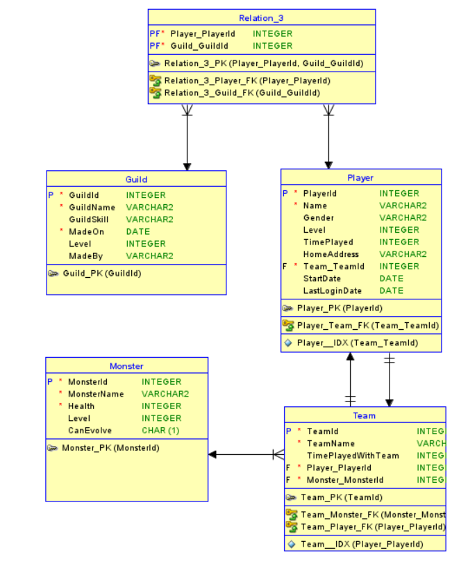

Milestone 2: Modellering
---
TOP DOWN MODELERING
---

Conceptueel Model
---

    Entiteittypes + Attributen + PK
---
- Player(**PlayerId**, Name, Birthdate, Gender, Level,TimePlayed, HomeAddress)
- Guild(**GuildId**, GuildName, GuildSkill, MadeOn, Level, PlayersInGuild, MadeBy)
- Team(**TeamId**, Monsters, TeamName, TimePlayedWithTeam)
- Monster(**MonsterId**,MonsterName, Health, Level, CanEvolve)

    Domeinen - constraints
--- 
- PlayerName: Starts with Capital and minimum 3 long
- PlayerLevel: PlayerLevel > 0
- GuildLevel: Level > 0 And Level < 100

    Tijd - historiek
---
- Player: TimePlayed
- Player: DaysPlayed: startDate, LastLoginDate

    Conceptueel ERD
---

Logisch Model
---

    Intermediërende  entiteiten
---
- Player_Guild: Players - Guilds

    Logisch ERD
---

Verschillen na Normalisatie
---
- toevoeging van tijds attributen (StartDate en LastLoginDate)
- Geen verdere veranderingen, maar wel verduidelijking hoe de monsters bij een team horen 
(TeamId in monster geeft een duidelijk beeld van bij welk team een monster hoort)

