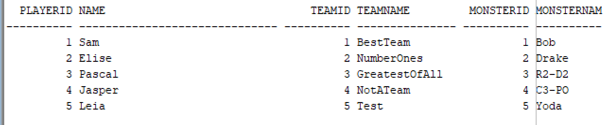

Milestone 3: Creatie Databank
---

    Identity columns
---
- Mandatory
  - guild: guildid, guildname, madeon
  - monster: monsterid, monstername, health, team_teamid
  - player: playerid, name
  - relation_1: guildid, playerid
- Other:
  - guild: madeby

      Table Counts
---

    @query 1: Relatie Veel-op-veel

SELECT PLAYER_PLAYERID,player.name,GUILD_GUILDID,guild.guildname FROM RELATION_1
JOIN player on player.playerid = PLAYER_PLAYERID
JOIN guild on guild.guildid = GUILD_GUILDID;
--- 

    @query 2: 2 niveau’s diep

SELECT playerid, name, team.teamid,team.teamname,monster.monsterid,monster.monstername FROM player
JOIN team ON team.teamid = player.playerid
JOIN monster ON monster.monsterid = team.teamid;
--- 

    @query 3: player_all

SELECT playerid,name,guild.guildid,guild.guildname, team.teamid, team.teamname, monster.monsterid,monster.monstername FROM player
JOIN team on team.player_playerid = player.playerid
JOIN monster on monster.team_teamid = team.teamid
JOIN relation_1 on player.playerid = relation_1.PLAYER_PLAYERID
JOIN guild on guild.guildid = relation_1.GUILD_GUILDID
ORDER BY playerid asc;
--- 

  Bewijs Domeinen - constraints M2
--- 
    Player: Start with capital and is 3 long

---

    Player: level larger then 0

---

    guild: level between 0 and 100

---

